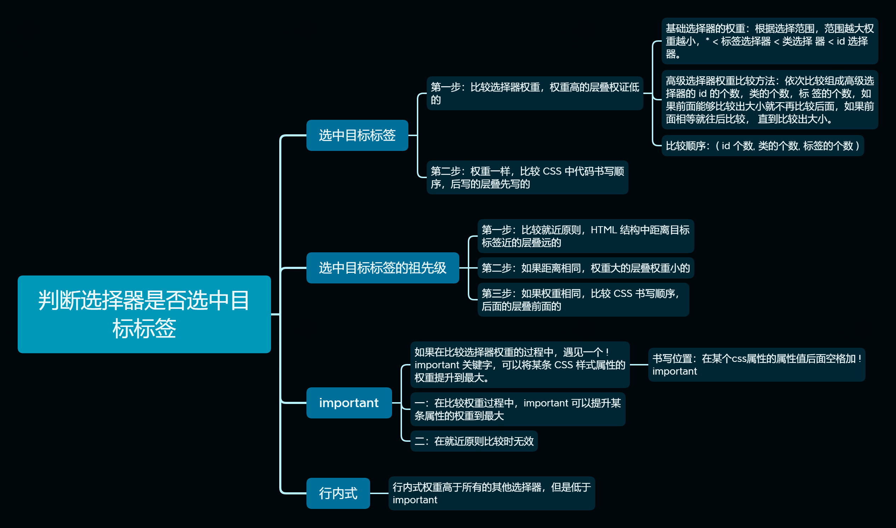

# CSS 语法

## CSS 规则

- CSS 规则由两个主要的部分组成：选择器，以及一条或多条声明语句

```css
p {
  width: 300px;
  font-size: 14px;
}
```

## 书写位置

### 内联式

- 内联式，也被习惯叫做行内式
- 在 HTML 标签上的 style 属性中书写 CSS 样式
- 所以的 CSS 样式属性总体组成标签的 style 属性的属性值

```html
<div style="width: 100px; height: 100px; font-size: 14px">1</div>
```

- 内联式必须写在标签之上，没有完全脱离 HTML 标签
- CSS 样式代码让标签结构繁重，不利于 HTML 结构的解读
- 一个内联的 CSS 代码，只能给一个标签使用，如果多个标签由相同的样式，同样的 CSS 代码需要书写多次，增加代码量

### 内嵌式

- 在 HTML 文件中， head 标签内部有一个 style 标签；style 标签书写在 title 标签后面，所有 CSS 代码书写在 style 标签内部
- style 标签有一个标签属性叫做 type，属性值是 `text/css`

```html
<style type="text/css">
  div {
    width: 100px;
    height: 100px;
    background-color: pink;
  }
</style>
```

- 实现了结构和样式的初步分离，CSS 只负责样式，HTML 负责结构
- 多个标签可以利用同一段代码设置相同的样式，节省代码量
- 结构和样式并没有完全分离，代码依旧书写在 HTML 文件的 style 标签内部
- CSS 样式只能给一个 HTML 文件使用，不能被多个 HTML 文件同时利用
- 在 HTML 中如果 CSS 代码太多，会造成文件头重叫轻

### 外联式

- 外联式 CSS，也叫外链式 CSS、外部 CSS
- 在一个单独的扩展名为 `.css` 的文件中
- 内部代码与内嵌式样式表中的 style 标签内部的代码一样，需要通过选择器去选中标签，添加对应的样式
- 在 `.css` 文件中书写时，不需要加 style 标签

```css
.box {
  width: 100px;
  height: 100px;
  border: 10px solid red;
}
```

#### 引用

- 外联式样式表必须引入到 HTML 文件中，才能正常进行加载
- 引入方式：在 HTML 中的 head 标签内部使用 link 标签进行引入
- link 标签属性：

| 属性名 | 属性值       | 说明                                                                        |
| ------ | ------------ | --------------------------------------------------------------------------- |
| rel    | stylesheet   | 表示引入的外部文件与 HTML 之间的关系，样式表                                |
| href   | css 文件路径 | hypertext reference，超文本引用                                             |
| type   | text/css     | 表示加载时代码按照纯文本形式的 css 代码加载。HTML5 中可以省略 type 属性不写 |

- 实现了 HTML 和 CSS 完全分离
- 多个 HTML 文件可以共用一个 CSS 文件，便于提取公共 CSS，减少代码量
- 可以实现一个 CSS 变化，多个 HTML 页面同时变化，减少工作量
- 一个 HTML 文件可以引入多个 CSS 文件，可以实现通过一个页面中 css 代码分层

### 导入式

- 书写位置：在内嵌样式表 style 标签内部，或者在外联样式表内部，导入其外部的 `.css` 文件
- 导入方式：利用一条 `@import url(路径)` 语句进行引入

```html
<style>
  @import url(css/index.css);
</style>
```

- 导入式样式表的 作用与外联式样式表基本相同
- 但是由于导入式在浏览器中加载时，会在 HTML 结构加载完毕再进行编译，如果网速比较慢时，会导致网页出现没有 CSS 样式的效果

## CSS 常用样式

### 文字三属性

#### 颜色 color

- 给文字设置颜色
- `color: 颜色名/颜色值`

**颜色名：**

- 颜色名就是使用颜色的因为单词进行表示
- [手册](https://www.runoob.com/cssref/css-colornames.html)

**颜色值：**

- 颜色值指使用具体颜色的数值表示
- 包括 rgb 模式和 十六进制模式写法

- rgb 模式

  - 根据红绿蓝三原色进行混合而成的颜色模式
  - 每个原色的取值范围时 0-255，一共 256 个数值，三个三原色共能混合成 1667 多万种颜色
  - 书写方法：`rgb(红, 绿, 蓝)`
  - [rgb 函数](https://www.w3school.com.cn/cssref/func_rgb.asp)

- 十六进制模式
  - 时 rgb 模式的一种简化写法，使用 十六进制的数字字符去替换十进制的 0-255 的数字
  - 十六进制：逢十六进 1，每个位数上只能出现 0-9，a-f 之间的字符
  - 书写颜色色值时，红、绿、蓝、每个色值都要使用两位数的十六进制进行替换 `0 -> 00` `255 -> ff`
  - 书写方式：使用 `#` 开头，后面连续书写红、绿、蓝 三个颜色的十六进制的两位数值
  - [手册](https://www.w3school.com.cn/cssref/css_colors.asp)
  - 十六进制颜色值简写模式：如果红、绿、蓝三个原色的色值每一个都是由重叠的数字组成，可以将重叠的数字简化成一个进行书写

#### 字体 font-family

- 定义元素内文字的字体
- `font-family: 字体名称`
- [字体](https://www.w3school.com.cn/css/css_font.asp)

1. font-family 可以设置多个字体名称，在实际加载时只会选择一种加载，选择的 依据是按书写顺序进行，如果浏览器不支持第一个字体，则会尝试下一个，直到找 到第一个支持的字体。
2. 浏览器中加载的字体是用户机器中自带的，如果用户的电脑中没有设置的字体则 加载失败，需要查找下一个，因此，必须在最后设置一个所有机器都具备的通用字 体作为后路。
3. 中文字体中一般带有英文可以加载的字体效果，为了避免对英文字的字体影响， 建议将英文字体写在属性值最前面。

#### 字号 font-size

- 设置文字的大小
- `font-size: 14px`

单位：

| **相对长度单位** | **说明**                                 |
| ---------------- | ---------------------------------------- |
| px               | 像素值，最常使用的单位                   |
| em               | 倍数，继承自祖先元素设置的字号的倍数     |
| %                | 百分比，继承自祖先元素设置的字号的百分比 |
| **绝对长度单位** | **说明**                                 |
| in               | 英寸                                     |
| cm               | 厘米                                     |
| mm               | 毫米                                     |
| pt               | 点                                       |

1. 如果 HTML 中不设置字号，不同的浏览器有自己默认的加载字号，比如 chrome、 IE，默认显示字号为 16px。
2. 不同的浏览器也有自己最小加载显示字号，如果设置的字号低于最小字号，都以 最小字号加载，0 除外。chrome 浏览器最小加载显示字号为 8px，IE 浏览器最小可 以支持 1px 的字号。

### 盒子实体化三属性

| 属性名           | 属性值         | 说明               |
| ---------------- | -------------- | ------------------ |
| width            | px 单位的数值  | 定义元素占有的宽度 |
| height           | px 单位的数值  | 定义元素占有的高度 |
| background-color | 颜色名、颜色值 | 定义元素的背景颜色 |

## CSS 选择器

在嵌入式和外部 CSS 中，要想将 CSS 样式应用于特定得 HTML 元素，首先需要找到改目标元素，这时需要用到 CSS 中得选择器

### 基础选择器

#### 标签选择器

- 通过标签名去选择标签元素
- 书写方式：标签名
- 选择范围：选中得是 HTML 文件中所有同名标签
- 注意： 标签选择器可以选择所有得同名标签，会忽视 HTML 元素得嵌套关系，不管嵌套多深，都能被选中
- 只能实现全选，不能对局部得标签添加特殊样式

#### id 选择器

- 通过标签上的 id 属性去选择标签
- 书写方式：`#id` 属性值
- 选择范围：只能选中一个标签
- id 命名规则：必须以字母开头，后面可以有字母、数字、下划线、横线，严格区分大小写。每个 id 属性值必须是唯一的不能与其他的 id 同名
- 注意：如果希望多个标签设置相同的样式，使用 id 选择器的话，必须给这多个标签取不同的 id 名，分别选中设置

#### 类选择器

- 通过标签的 class 属性去选择标签
- 书写方式：`.class` 属性值
- 选择范围：是页面中所有 class 属性值相同的标签
- class 命名规则：必须以字母开头，后面可以有字母、数字、下划线、横线，严格区分大小写，class 属性值可以与其他的 class 相同

- 多个不同的标签，不区分标签类型，只要 class 属性值相同，都可以被同一个选择器选中
- 一个标签的 class 属性可以有多个属性值，值之间用空格分隔，每个属性值组成的选择器，都可以选中这一个标签，每个选择器后面的样式都会添加给同一个标签

在 css 中提前设置一些类名，每个类选择器后面只添加一条 CSS 样式属性，这些属性会在页面中常被使用，后期可以不用书写多次属性，只要将对应的类名添加给需要的标签即可

#### 通配符选择器

- 通过一个特殊符号选择页面内所有的标签。
- 书写方式：`*`
- 选择范围：包含 `<html>`标签在内的所有标签。

- 优点：可以实现全选，简化书写。
- 缺点：通配符选择效率低，设置的部分公共样式不是所有标签都需要添加，如果使 用通配符选择，会让不需要的标签也加载一次样式，导致浏览器多做无用的工作。
- 注意：实际上线的网站不允许使用 \* 去清除默认内外边距。
- 不过普通的案例，代码量较少时，为了节省书写，可以使用通配符。

### 高级选择器

由于基础选择器不能实现所有选择情况，后期在基础选择 器的基础上衍生出了几种高级选择器。高级选择器的组成 部分是基础选择器。

#### 后代选择器

- 通过标签之间存在的嵌套关系（族谱关系）去选择元素，基本组成部分就是基础选择器
- 后代选择器也叫包含选择器
- 书写方式：空格表示后代，基础选择器中间使用空格分隔，空格前面的选择器选中的标签必须是后面选择器选中标签的祖先级
- 选择范围：通过后代选择器中前面的一系列基础选择器缩小选择范围，最终由最后一个选择器确定选中的标签
- 后代选择器必须满足所有的后代关系才能够被选中，后代关系不一定只能是父子关系

#### 交集选择器

- 通过一个标签之上满足所有的基础选择器的需求去选择标签
- 书写方式：基础选择器进行连续书写，如果有标签选择器参与交集，必须书写在开头
- 选择范围：选择的是满足所有的基础选择器需求标签，如果一个条件不能满足都不能被选中

#### 并集选择器

- 不同选择器选中的元素都要设置相同的样式，多次书写相同的样式属性对代码造成 浪费，可以将前面六种选择器可以进行并集书写，相当于一种简化写法。
- 书写方式：将多个选择器中间用逗号进行分隔，最后一个后面不能加逗号。
- 选择范围：是所有的单独选择器选中的标签的并集集合。

## CSS 层叠式

### 继承性

- 如果一个标签没有设置过一些样式，他的某个祖先级曾经设置过，在浏览器中该标签也加载了这些样式，这些样式都是从祖先继承而来，这种现象就是继承性
- 能够被继承的样式是所有的**文字相关样式属性**，其他的属性都不能被继承
- 继承性是一个很好的性质，可以将页面中出现最多的文字样式设置给一个较大的祖 先级标签比如 `<body>`，后期所有的后代标签都可以从 `<body>` 进行继承。

```css
body {
  font‐size: 14px;
  font‐family: "微软雅黑";
  color: red;
}
```

### 层叠性

- 多个选择器在进行对比的过程中，最终只 有一个属性会成功加载，它会层叠、覆盖掉其他的属性
- 判断最终胜出的属性是谁，需要依赖判断优先级


